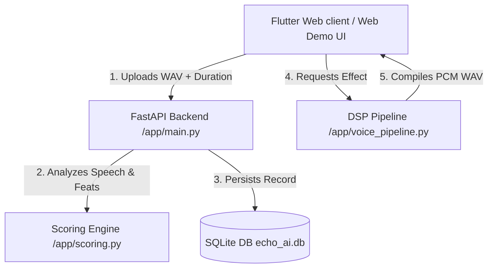

# Echo AI – Communication Intelligence Platform

Echo AI is a Progressive Web App (PWA) designed to capture, process, and analyze speech for communication intelligence. The platform tracks vocal parameters like Words Per Minute (WPM), speech continuity, pace consistency, and filler words to estimate Confidence and Communication scores.

## Key Features

1.  **Dual Recording Modes**:
    *   **Recorder Mode**: Traditional manual stop/start/play controls.
    *   **Echo Mode**: Press-and-hold interaction that instantly records on pointer down and plays back immediately on pointer up.
2.  **Selectable Mic Animations**:
    *   **Pulse**: A pulsing concentric ring expanding in size.
    *   **Sound Wave**: Eq equalizer bars leaping dynamically.
    *   **Ripple**: Concave rings radiating outward.
    *   **Neon Glow**: A breathing neon shadow halo.
    *   **Futuristic HUD**: Dual rotating telemetry rings.
3.  **Voice Effects DSP Pipeline**: Audio playback in Original, Robot, Deep, Chipmunk, Cartoon, and Radio voices.
4.  **AI/ML Analytics Dashboard**: Visualizes score trends, average stats, and pace classifications (Slow, Normal, Fast).
5.  **Structured Datasets**: Session data collection exported to CSV for analytical science.

---

## Technical Architecture



---

## Installation & Local Execution

### 1. Backend Server Setup
To configure and start the FastAPI web server:

```bash
# Navigate to the backend directory
cd backend

# Install dependencies (or run using fallback modules)
pip install -r requirements.txt

# Start the web server
python run.py
```
*The server will start running on [http://localhost:8000](http://localhost:8000).*

### 2. Seeding Dashboard Mock Data
To populate the SQLite database with 30 days of progressive communication sessions (to instantly generate dashboard analytics):

```bash
python datasets/generate_mock_data.py
```

### 3. Data Science Analytics
To compile user records, compute standard deviations/correlations, and export structured analytics:

```bash
python datasets/data_analysis.py
```
*This extracts sessions data, creates `datasets/user_sessions.csv`, and generates correlation charts.*

### 4. Running the Flutter Frontend PWA
Once the Flutter SDK is set up on your environment:

```bash
# Navigate to the frontend directory
cd frontend

# Install Flutter packages
flutter pub get

# Run the Flutter Web server
flutter run -d chrome --web-port=8080
```

---

## Security & Privacy-First Design
*   **On-Demand Permissions**: Requests microphone access in browser only when triggering recording.
*   **Local File Operations**: WAV audio streams are saved locally inside secure subfolders and can be deleted instantly via SQLite hooks.
*   **Anonymized Session IDs**: Logs sessions against random UUIDs rather than raw credentials.
